I'm an SRE and live in Denver. Don't contact me about cryptocoin "opportunities" - kleptocoins are an ecological disaster at best and also usually Ponzi scams and I want nothing to do with the entire ecosystem.

- 💬 My blog is at [unixorn.github.io](https://unixorn.github.io/post/).
- 🐘 My Mastodon is [@unixorn@hachyderm.io](https://hachyderm.io/@unixorn)
- 🔭 When I'm not maintaining my various lists and projects, I’m usually tinkering on some IOT (More specifically, [Home Assistant](https://unixorn.github.io/tags/home-assistant/) projects or playing around with some ARM boards.
- ⚡ I enjoy cooking, especially baking.
- ⚡ I enjoy hiking and have summited a couple fourteeners (Quandary and Mt. Bierstadt).

If you like the lists I'm maintaining or the other projects I blog about, you can [sponsor me](https://github.com/sponsors/unixorn), or buy geeky swag from my [spreadshirt](https://www.spreadshirt.com/shop/user/unixorn/?srEdit=pa#?affiliateId=11625) and [redbubble](https://www.redbubble.com/people/unixorn/shop) shops.

  

 

  
Full history

  </img>

 

